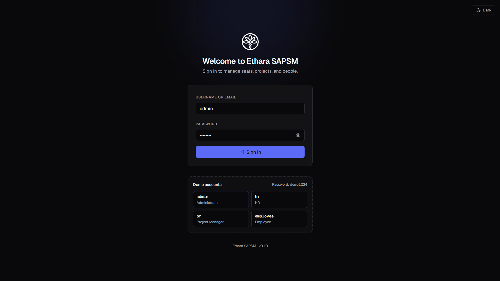
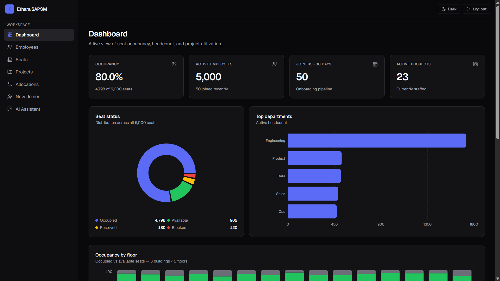
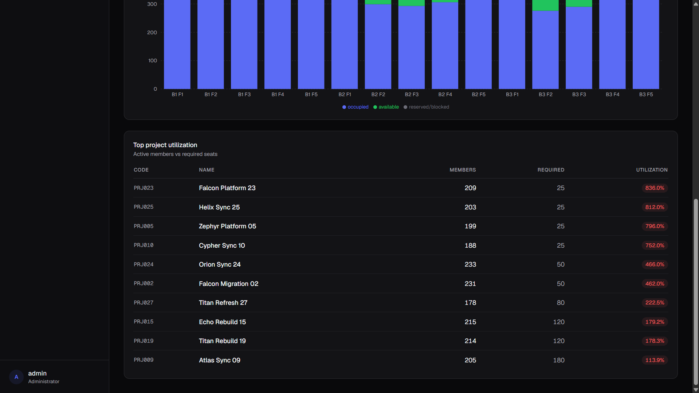
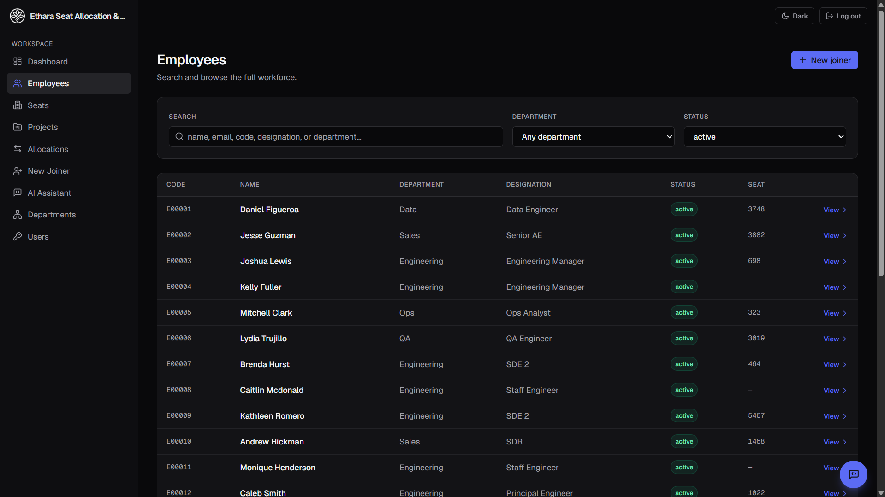
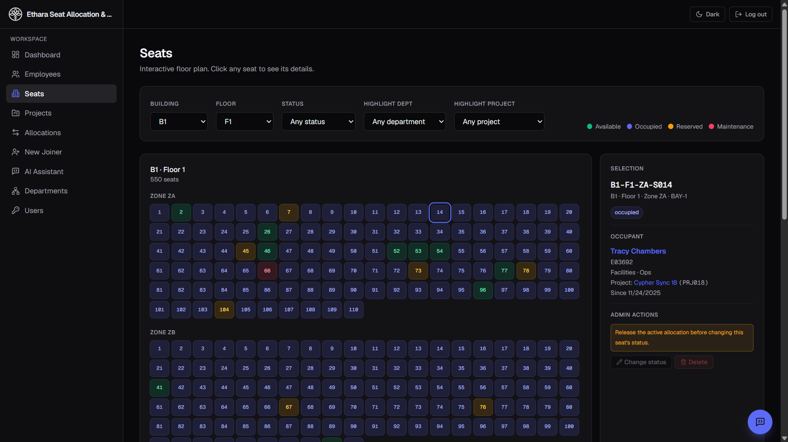
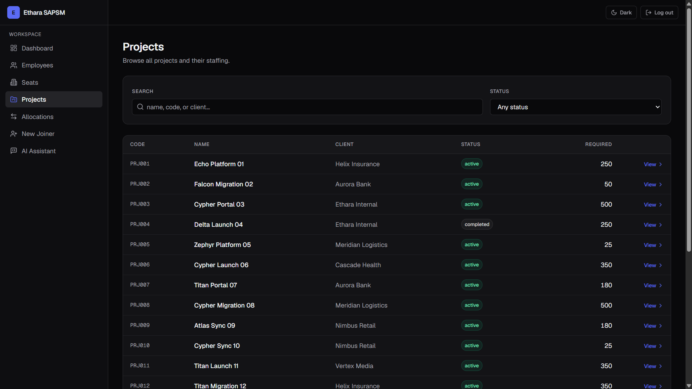
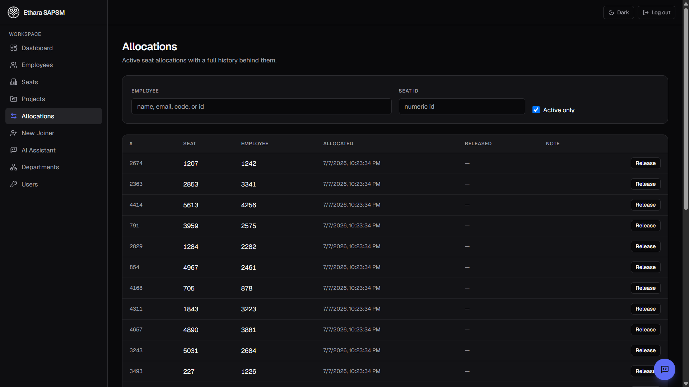
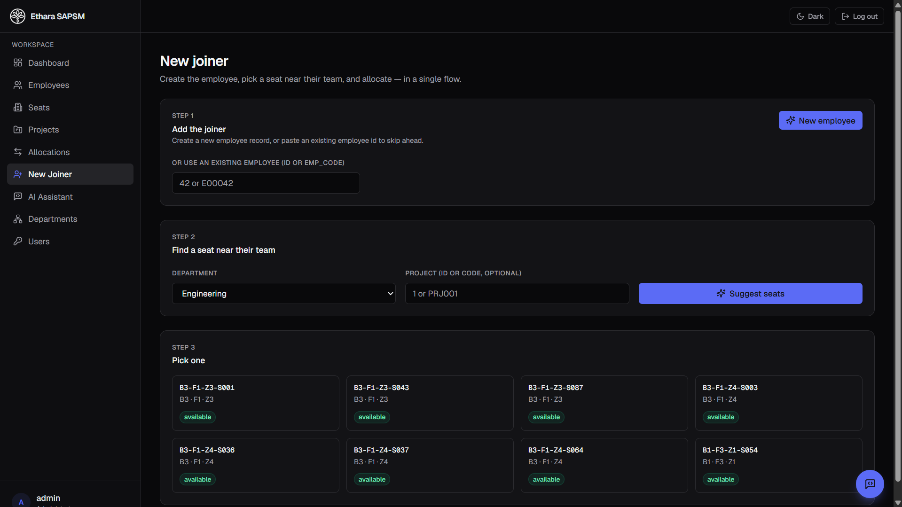
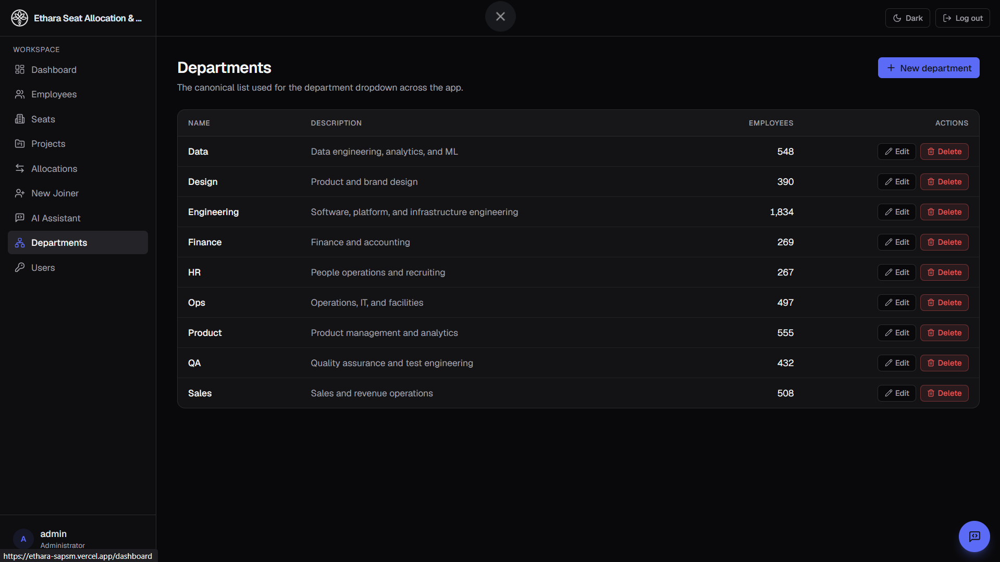
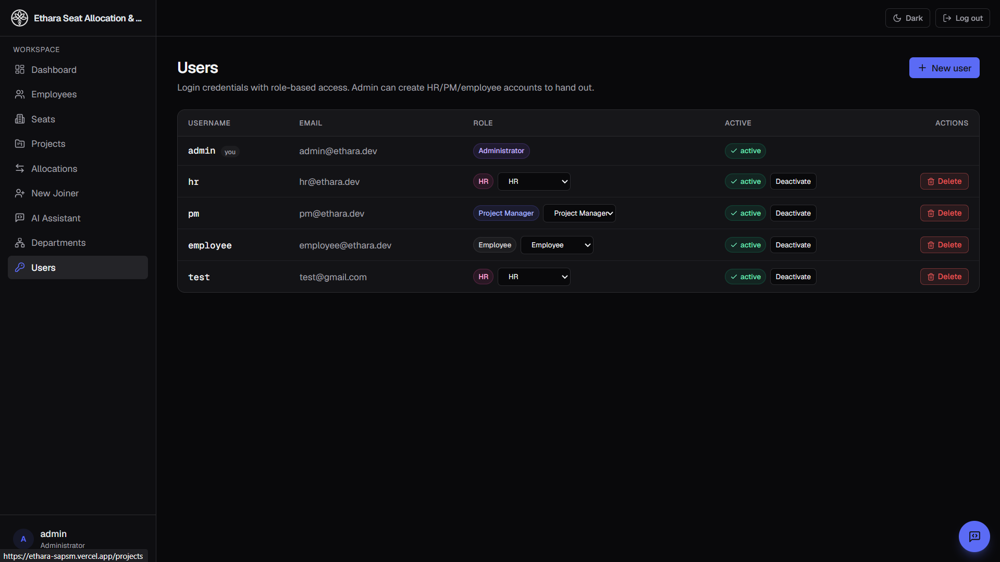

# Ethara SAPSM — User Guide

A walkthrough of every page in the app, what each role can do on it, and how to complete the common workflows an evaluator might want to try.

- **Live app:** https://ethara-sapsm.vercel.app
- **API docs (Swagger):** https://ethara-sapsm.onrender.com/docs
- **Assessment submission** — the credentials below are seeded specifically for evaluation.

> **First request is slow.** The backend runs on Render's free tier and sleeps after ~15 minutes of idle. The first page load after a nap takes about 30 seconds while it wakes up. Everything after that is snappy.

---

## Table of contents

1. [Sign in](#1-sign-in)
2. [The workspace layout](#2-the-workspace-layout)
3. [Dashboard](#3-dashboard)
4. [Employees](#4-employees)
5. [Seats](#5-seats)
6. [Projects](#6-projects)
7. [Allocations](#7-allocations)
8. [New Joiner](#8-new-joiner)
9. [AI Assistant](#9-ai-assistant)
10. [Departments (admin)](#10-departments-admin)
11. [Users (admin)](#11-users-admin)
12. [Roles at a glance](#12-roles-at-a-glance)
13. [End-to-end workflows](#13-end-to-end-workflows)
14. [Troubleshooting](#14-troubleshooting)

---

## 1. Sign in

Go to the login page and enter one of the seeded credentials below. Use the eye icon to reveal the password if you'd like to double-check what you typed. The dark-mode switch in the top-right toggles the theme; the app remembers your choice.

**Demo credentials** (all share the same password):

| Username   | Role              | Password   |
| ---------- | ----------------- | ---------- |
| `admin`    | Administrator     | `demo1234` |
| `hr`       | HR                | `demo1234` |
| `pm`       | Project Manager   | `demo1234` |
| `employee` | Employee          | `demo1234` |

If you're evaluating the full feature set, sign in as `admin` first — that account can see and do everything, including creating additional users for HR/PM/Employee if you want to test those flows fresh.

---

## 2. The workspace layout

Once signed in, every page shares the same shell:

- **Left sidebar** — the navigation. Items are role-gated: an `employee` user, for instance, won't see `Users` or `Departments`.
- **Top-right** — dark-mode toggle and log-out.
- **Bottom-left** — your current user chip (username + role). The role is a quick reminder of what you can and cannot do on the current page.
- **Floating chat bubble (bottom-right)** — the AI Assistant. It's always one click away.

---

## 3. Dashboard

The landing page after login. It's a live snapshot — every widget hits the database fresh, so numbers reflect the current state.

**Top row — four KPIs:**

- **Occupancy** — occupied seats / total seats across all buildings. This is the number executives care about.
- **Active employees** — headcount excluding on-leave and exited.
- **Joiners · 30 days** — how many employees joined in the last 30 days (the onboarding pipeline).
- **Active projects** — currently-running projects (excludes completed/on-hold).

**Middle row:**

- **Seat status donut** — Occupied / Available / Reserved / Maintenance, with totals in the legend.
- **Top departments** — horizontal bar chart of active headcount, ordered.

**Bottom row:**

- **Occupancy by floor** — stacked bar per floor across all 3 buildings × 5 floors (15 columns). Occupied is blue, available is green, reserved/maintenance is grey.
- **Top project utilization** — active members ÷ required seats, capped at 100%. Any project that is over-allocated shows an `over by N` badge instead of an inflated percentage, so utilisation stays readable.

Hover any chart segment to see exact values in a tooltip.

---

## 4. Employees

Browse and search the full workforce. The filters at the top are all live — changing any of them re-queries the backend and resets pagination.

- **Search** — matches partial text against name, email, employee code, designation, **or** department. Type `eng` and you'll get every engineer plus everyone in Engineering.
- **Department** — dropdown backed by the canonical department list from the Departments admin page. "Any department" clears the filter.
- **Status** — defaults to `active` so the total matches the dashboard KPI. Switch to `Any status` to include on-leave and exited employees.
- **Pagination** — 25 rows per page.

**Row actions:**

- Click **View** on any row (or the name) to open the employee profile.
- The profile shows contact info, current seat with building/floor/zone, current project, and a **Change status** control for admin/HR (marking someone `exited` also stamps today's date as their exit date, so history stays clean).
- The **Delete** button lives on the profile page, not the list, so nobody nukes a row by accident.

**Who can do what:**

- Everyone can search and view.
- Only `admin` and `hr` see the **New joiner** shortcut and the delete/status controls.

---

## 5. Seats

An interactive floor plan. Pick a **Building** (B1/B2/B3), a **Floor** (F1..F5), and optionally a **Status** filter — the grid re-renders instantly with per-status colour coding (available green, occupied blue, reserved amber, maintenance red).

Click any seat to open the **Selection** panel on the right:

- The seat's full code (e.g. `B1-F1-ZA-S055`), building/floor/zone/bay.
- If occupied: the current occupant's name, department, and since-date.
- **Admin actions** (admin only): change the seat's status (mark as maintenance, reserve, or free it back to available), or delete the seat entirely. Deleting is guarded — you can't delete a seat while someone is actively sitting in it; release the allocation first.

The layout is the real physical grid used by the seed data: 3 buildings × 5 floors × 4 zones × 100 seats = 6,000 seats. Each zone is split into 4 physical bays (BAY-1..BAY-4); the seat code (`B1-F3-ZA-S045`) encodes building/floor/zone/seat-number, and the bay is shown in the Selection panel.

---

## 6. Projects

The staffing view. Every project shows its code, name, client, current status (active / on-hold / completed), and required-seat count.

- **Search** — matches partial text against code, name, or client.
- **View** opens the project detail page: description, members, allocations, and the ability to add/remove members (PM or admin).
- **New project** button (admin/PM only) opens the create form — code, name, client, description, required seats, dates.
- Per-row delete (admin only) removes the project and cascades allocations cleanly.

The first 11 seeded projects use the exact names the assessment spec asks for — Indigo, Indreed, Mydreed, Preed, Serfy, Oreed, bedegreed, Opreed, Serry, Kaary, Mered. The remaining rows are generated so the dashboard's utilisation spread stays interesting. Seed data intentionally puts the top 2 projects at exactly 100% utilisation; the rest are staffed at 87–98% so the utilisation table on the dashboard shows a realistic spread.

---

## 7. Allocations

The chronological ledger of every seat-to-employee assignment ever made. Filter by employee (name/email/code/id) or seat id. **Active only** is on by default — turn it off to see the full historical log with release timestamps.

- Each row shows the allocation's serial number, seat, employee, allocated-at, released-at (or `—` if still active), and any operator note.
- Per-row **Release** button (admin/HR) frees the seat immediately and stamps the release timestamp. The employee's `current_seat_id` on their profile updates in the same transaction.

Think of this page as the audit log — the source of truth for "who sat where when."

---

## 8. New Joiner

A guided 3-step flow to onboard someone from zero to a seat in under a minute. Admin/HR only.

**Step 1 — Add the joiner.** Either click **New employee** to open the create form, or, if the record already exists, just paste the employee's id or `emp_code` (like `E00042`). Either works.

**Step 2 — Find a seat near their team.** Pick the department the joiner is joining, and optionally a project id/code (like `PRJ001`) if you know their assigned project. Click **Suggest seats**.

The suggestion engine ranks vacant seats by:

1. Zones where the joiner's teammates already sit (proximity to team).
2. Fewest-remaining-vacancies-first — the algorithm packs scarce zones before scattering people into empty floors, so buildings fill up predictably instead of leaving half-empty pockets everywhere.

**Step 3 — Pick one.** The suggestions come back as clickable seat cards showing code, building/floor/zone, and status. Click one to allocate; the flow completes and the seat's Selection panel now shows the new occupant.

---

## 9. AI Assistant

Open it from the sidebar or the floating chat bubble at the bottom-right of any page.

Ask questions in plain English:

- *"How many active engineers do we have?"*
- *"Which floor has the most free seats?"*
- *"Top 5 projects by member count"*
- *"How many seats for QA"*

The assistant translates the question to read-only SQL, runs it against the database, and answers with the number plus a **Generated SQL** disclosure you can expand to see exactly what ran. Every query is logged.

Under the hood there are five safety layers — the schema is scoped, the prompt hardcodes read-only constraints, a SQL parser rejects anything mutating, the connection sets `read only + statement_timeout`, and every query is audited. Non-admin roles can't see other users' PII: only `admin` can toggle **Show all users** to include email/phone in results.

If the model returns something unhelpful, click **Ask again** on any prior message to re-run it.

---

## 10. Departments (admin)

Admin-only. The canonical list of departments used by every dropdown in the app (employees filter, new-joiner suggestion, etc.). One row per department with name, description, and current active headcount.

- **New department** — add a new one; instantly available in every dropdown across the app on next render.
- **Edit** — rename or update the description. Renaming cascades to every employee record in a single transaction, so nothing is left pointing at the old name.
- **Delete** — only available for departments with no active employees (the button is disabled otherwise, to prevent orphaning people).

---

## 11. Users (admin)

Admin-only. The login accounts for the app itself (separate from the employee records — an employee doesn't automatically have a login).

- **New user** — creates a user with an auto-generated 14-character password shown once in a green credentials panel with **Copy** buttons. Copy them, hand them to the person, done.
- **Role dropdown** — inline change per row. Admin → HR → PM → Employee.
- **Deactivate / Reactivate** — soft off-switch, keeps the row.
- **Delete** — hard removal.

**Self-protection guards:**

- Your own row shows a `you` chip and has no controls — you can't demote or delete yourself.
- If you're the last active admin, the backend refuses to demote or deactivate you regardless of who's asking. This keeps you from locking everyone out.

---

## 12. Roles at a glance

| Capability                             | Admin | HR  | PM  | Employee |
| -------------------------------------- | :---: | :-: | :-: | :------: |
| View dashboard & employees             |   ✓   |  ✓  |  ✓  |    ✓     |
| Search / filter                        |   ✓   |  ✓  |  ✓  |    ✓     |
| Use AI Assistant                       |   ✓   |  ✓  |  ✓  |    ✓     |
| See other users' PII in AI results     |   ✓   |     |     |          |
| Create / edit employees                |   ✓   |  ✓  |     |          |
| New-joiner flow (onboard + allocate)   |   ✓   |  ✓  |     |          |
| Release a seat allocation              |   ✓   |  ✓  |     |          |
| Change a seat's status (maintenance/reserve) |   ✓   |     |     |          |
| Delete a seat                          |   ✓   |     |     |          |
| Create / delete projects               |   ✓   |     |  ✓  |          |
| Add / remove project members           |   ✓   |     |  ✓  |          |
| Manage departments                     |   ✓   |     |     |          |
| Manage users (create/role/deactivate)  |   ✓   |     |     |          |

Anything a role can't do is either not shown in the UI at all (so the button isn't tempting) or rejected by the API with a 403.

---

## 13. End-to-end workflows

Concrete recipes an evaluator can run through in a few minutes.

### A. Onboard a new hire

1. Sign in as `admin` (or `hr`).
2. Sidebar → **New Joiner**.
3. Step 1: click **New employee**, fill in name/email/department/designation/joining date, save.
4. Step 2: pick their department, optionally a project code, click **Suggest seats**.
5. Step 3: click one of the suggested seat cards.
6. Verify: open **Seats**, navigate to that seat's building/floor, click the seat — the Selection panel now shows the new occupant.

### B. Move someone to a different seat

1. Sidebar → **Allocations**.
2. Filter by their name; click **Release** on their current active allocation.
3. Sidebar → **Seats**; click an available seat; use the Selection panel to allocate it to them (or run the New Joiner flow with their existing employee id).

### C. Handle an exit

1. Sidebar → **Employees**, open the employee's profile.
2. Click **Change** next to their status chip, pick `exited`, save. The exit date is stamped automatically.
3. Sidebar → **Allocations**, filter by their name, and release their active seat. It now shows in the "Available" pool on the floor plan.

### D. Ask the AI a question

1. Click the floating chat bubble on any page.
2. Ask: *"How many available seats are in B1?"*
3. Expand **Generated SQL** to see the query that ran. Click **Ask again** to re-run the same question.

### E. Create a new team lead account

1. Sign in as `admin`.
2. Sidebar → **Users**, click **New user**.
3. Fill in username / email / role. On save, the auto-generated password appears in a green panel with **Copy** buttons — copy it, share it out-of-band.
4. The new user can now sign in with those credentials and see only what their role allows.

---

## 14. Troubleshooting

| What you see                                              | What's happening                                                                                                                                                                        |
| --------------------------------------------------------- | --------------------------------------------------------------------------------------------------------------------------------------------------------------------------------------- |
| First page load takes ~30 seconds                         | Render free-tier cold start. Subsequent requests are fast.                                                                                                                              |
| "Login failed. Is the backend running?"                   | Backend is still waking up — refresh in ~30 seconds. If it persists, check https://ethara-sapsm.onrender.com/docs; if that also fails to load, Render is asleep, hit it once and retry. |
| "Session expired, please sign in again"                   | JWT access token expired. Sign back in.                                                                                                                                                 |
| A button (delete / new / change status) doesn't appear    | Your role can't perform that action. Sign in as `admin` to see everything.                                                                                                              |
| Dashboard number differs slightly between refreshes       | The dashboard is live — headcount, allocations, and joiners really do change as you use the app (or as other evaluators do).                                                            |
| AI Assistant answers "I couldn't answer that from the DB" | The question either wasn't a query the assistant could safely translate (e.g. asks for a mutation), or it fell outside the schema scope. Rephrase and try again.                        |

If something looks wrong that isn't in this table, the raw API is at https://ethara-sapsm.onrender.com/docs — every endpoint the UI uses is browsable and callable there with the same JWT.
